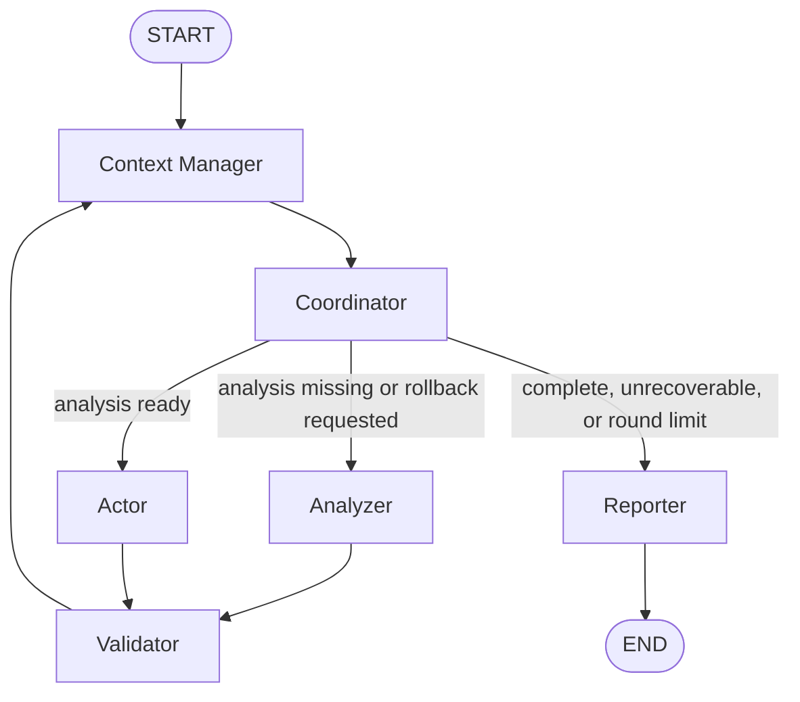

# Multi-Agent Guardrail Orchestrator

A LangGraph financial-trading demonstration with six deterministic guardrails.
The financial domain is a safe mock: the repository never places a real trade
or performs a destructive external action.

## Architecture



The Coordinator evaluates state in this order:

1. A validated result routes to the Reporter.
2. An unrecoverable schema failure routes to a degraded report.
3. The fifth Coordinator visit activates the loop guard and routes to the
   Reporter.
4. A rejection or rollback request routes back to the Analyzer.
5. Missing structured analysis routes to the Analyzer.
6. Valid structured analysis routes to the Actor.

The Validator checks typed Analyzer data and sanitizes mocked Actor output
before completion or rollback.

## Deliverable layout

The repository root is the assignment's `orchestrator-trading-bot/` directory.
The UI is intentionally isolated in `app/`.

```text
orchestrator-trading-bot/
├── README.md
├── DESIGN_DOCS.md
├── INTERVIEW_STORIES.md
├── contract.py
├── main_system.py
├── app/                         # Streamlit presentation UI
├── orchestrator/                # Unified graph implementation
├── tests/                       # Automated verification
├── student_1_loop/
│   ├── snippet.py
│   ├── test_failure.py
│   └── METRICS.md
├── student_2_silent/
│   ├── snippet.py
│   ├── test_failure.py
│   └── METRICS.md
├── student_3_rogue/
│   ├── snippet.py
│   ├── test_failure.py
│   └── METRICS.md
├── student_4_cascade/
│   ├── snippet.py
│   ├── test_failure.py
│   └── METRICS.md
├── student_5_trace/
│   ├── snippet.py
│   ├── test_failure.py
│   └── METRICS.md
└── student_6_tokens/
    ├── snippet.py
    ├── test_failure.py
    └── METRICS.md
```

`contract.py` is the frozen Pydantic contract shared by every node.
`main_system.py` is the required unified entry point. Supporting graph modules
live in `orchestrator/`, while each student directory provides an isolated
grading view, deterministic failure reproduction, and measured baseline.

The individual two-minute failure/success recordings and the combined
five-minute team recording are external submission artifacts; binary video
files are not committed to this code repository.

## Ownership

| Owner | Guardrail | Production implementation | Individual folder |
|---|---|---|---|
| Student 1 | Infinite graph loop | `orchestrator/nodes/coordinator.py`, `orchestrator/guardrails/loop_guard.py`, `orchestrator/routing.py` | `student_1_loop/` |
| Student 2 | Silent hallucination | `orchestrator/nodes/analyzer.py`, `orchestrator/guardrails/structured_output_guard.py` | `student_2_silent/` |
| Student 3 | Rogue tool execution | `orchestrator/nodes/actor.py`, `orchestrator/guardrails/tool_guard.py`, `orchestrator/tools/` | `student_3_rogue/` |
| Student 4 | Cascade failure | `orchestrator/nodes/validator.py`, `orchestrator/guardrails/cascade_guard.py` | `student_4_cascade/` |
| Student 5 | Telemetry privacy leak | `orchestrator/guardrails/privacy_guard.py`, `orchestrator/utils/redaction.py` | `student_5_trace/` |
| Student 6 | Context/token explosion | `orchestrator/nodes/context_manager.py`, `orchestrator/guardrails/context_guard.py` | `student_6_tokens/` |

## Language stack

- Python 3.12
- LangGraph and LangChain Core
- Pydantic v2
- LangSmith
- Streamlit
- pytest

## Setup with Conda

```bash
conda create -n multi-agent python=3.12 -y
conda activate multi-agent
python -m pip install --upgrade pip
python -m pip install -e ".[dev]"
cp .env.example .env
```

The environment file contains these five required settings:

```env
DEEPINFRA_API_TOKEN=
DEEPINFRA_MODEL=
DEEPINFRA_BASE_URL=
LANGSMITH_API_KEY=
LANGSMITH_PROJECT=
```

Automated tests and failure demonstrations use deterministic mocks and do not
require live service credentials.

## Run

Run the unified orchestrator:

```bash
python main_system.py \
  --input "AAPL rose 4% in ten minutes on unusual volume; consider 10 shares."
```

Run the presentation UI:

```bash
streamlit run app/app.py
```

Run all tests:

```bash
pytest -q
```

Run one test group:

```bash
pytest tests/guardrails -q
pytest tests/integration -q
pytest tests/architecture -q
```

Run the six deterministic before/after demonstrations:

```bash
python student_1_loop/test_failure.py
python student_2_silent/test_failure.py
python student_3_rogue/test_failure.py
python student_4_cascade/test_failure.py
python student_5_trace/test_failure.py
python student_6_tokens/test_failure.py
```

Each demonstration prints `WITHOUT GUARDRAIL`, `WITH GUARDRAIL`, and `METRICS`
sections.
